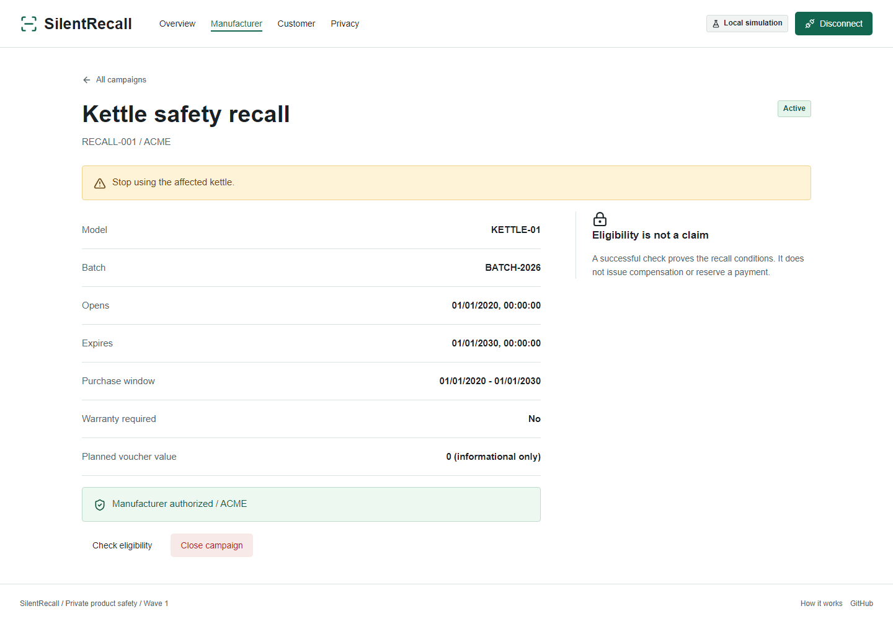
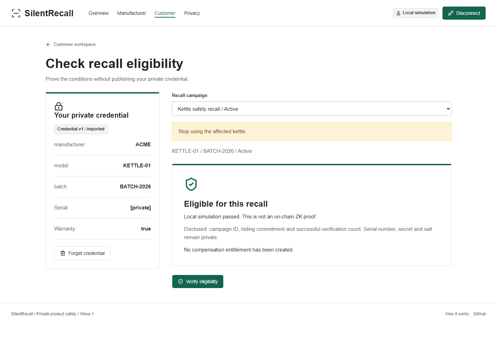

# SilentRecall

[](https://github.com/vantuann205/silent-recall/actions/workflows/ci.yml)
[](LICENSE)
[](https://nextjs.org)
[](https://docs.midnight.network)
[](docs/wave-roadmap.md)

**Privacy-preserving product recall eligibility verification using Midnight and zero-knowledge proofs.**

Recalls should not require publishing a customer's identity, receipt or product serial. SilentRecall lets a product owner prove that a manufacturer-registered private credential satisfies a public recall's conditions.

**Wave 1 complete — 30% of the full SilentRecall roadmap.** Wave 2 and Wave 3 are not implemented. This is experimental software, not an audited compensation system. See [verification evidence](docs/testing.md).




## What Works

- Constructor-bound manufacturer authority and protected administrative circuits.
- Private credential generation, bounded local JSON import/export and masked summaries.
- Domain-separated hiding commitment registration with duplicate rejection.
- Immutable recall campaigns, date/warranty conditions, public listing and confirmed closing.
- Real zero-knowledge eligibility transactions using Midnight.js and connector-v4 wallet providers.
- Public product/campaign/check counts, network failures and retry states.
- Responsive accessible workspaces and an explicitly labelled development simulation.

No claims, nullifiers, vouchers, payments, revocation or ownership transfer. Planned voucher value is informational only.

## Public and Private

| Public ledger                              | Private / local                          |
| ------------------------------------------ | ---------------------------------------- |
| Authority hash and manufacturer ID         | Authority secret                         |
| Hiding product commitment                  | Serial, product secret, random salt      |
| Recall conditions, dates and safety notice | Complete credential opening              |
| Aggregate successful verification count    | Exact purchase date and warranty witness |

The proving provider receives private witnesses: use a trusted local prover. The public registry reveals the commitment used, so repeated checks can be linked. The app does not collect identity, purchase location, purchase price or ownership history. These are boundaries, not a promise to hide all network or wallet metadata.

## Pinned Toolchain

Verified against [official installation guidance](https://docs.midnight.network/getting-started/installation), [Midnight.js](https://docs.midnight.network/sdks/official/midnight-js) and [official create-mn-app](https://github.com/midnightntwrk/create-mn-app) on 8 September 2026.

| Component                            | Version               |
| ------------------------------------ | --------------------- |
| Node / pnpm                          | 24 / 10.30.3          |
| Next.js / React                      | 16.3.4 / 19.2.4       |
| TypeScript / Tailwind                | 5.9.3 / 4.2.1         |
| Compact compiler / runtime           | 0.31.1 / 0.16.0       |
| Midnight.js / connector API          | 4.1.1 / 4.0.1         |
| Wallet SDK / ledger                  | 1.2.0 / 8.1.0         |
| Node / indexer / proof-server images | 1.0.0 / 4.3.3 / 8.1.0 |

`pnpm-workspace.yaml` pins compatible ledger/on-chain runtime versions across wallet subpackages. Upgrade Midnight packages together and rerun genuine proof integration. Do not mix old tutorial artifacts with this compiler.

## Run Locally

Prerequisites: Git, Node 24, pnpm 10.30.3, Docker Compose v2, and Compact 0.31.1. Allow several GB for dependencies, compiler/proving artifacts and Docker images. Linux/macOS can run Compact directly; Windows uses **WSL Ubuntu** for compilation and Docker Desktop.

### 1. Install

```sh
git clone https://github.com/vantuann205/silent-recall.git
cd silent-recall
npm install --global pnpm@10.30.3
pnpm install --frozen-lockfile
```

Install Compact in Linux/macOS or inside WSL Ubuntu:

```sh
curl --proto '=https' --tlsv1.2 -LsSf https://github.com/midnightntwrk/compact/releases/download/compact-v0.5.2/compact-installer.sh | sh
export PATH="$HOME/.compact/bin:$HOME/.local/bin:$PATH"
compact update 0.31.1
compact compile --version
```

On Windows the compile script invokes `wsl -d Ubuntu` automatically. Ensure `compact` is available to its login shell. Other WSL distribution names require adapting that one script.

### 2. Compile and Configure

```sh
pnpm contract:compile
cp .env.example .env.local
```

PowerShell equivalent: `Copy-Item .env.example .env.local`.

The compiler generates `contract/generated` and copies public proving assets into `public/zk`; both are ignored by Git. A clean clone must compile before typecheck, build or tests. `pnpm contract:compile --fast` is only for deterministic circuit tests, not real proofs.

| Environment variable           | Meaning                                                                                   |
| ------------------------------ | ----------------------------------------------------------------------------------------- |
| `NEXT_PUBLIC_MIDNIGHT_NETWORK` | `undeployed` for isolated local network                                                   |
| `NEXT_PUBLIC_CONTRACT_ADDRESS` | Deployed 64-character hexadecimal address; blank before deployment                        |
| `NEXT_PUBLIC_INDEXER_HTTP`     | Public read endpoint, default `http://127.0.0.1:18088/api/v4/graphql`                     |
| `NEXT_PUBLIC_INDEXER_WS`       | Public subscription endpoint, default `ws://127.0.0.1:18088/api/v4/graphql/ws`            |
| `NEXT_PUBLIC_PROOF_SERVER`     | Documented local prover endpoint; browser signing uses the wallet's proving configuration |
| `NEXT_PUBLIC_ENABLE_DEMO`      | `true` enables labelled simulation in development only                                    |

All `NEXT_PUBLIC_*` values are public. **Never put authority keys or wallet seeds there.** Changes require restarting the app; production values are embedded at build time.

### 3. Local Network and Genuine Proof

```sh
docker compose up -d --wait
docker compose ps
pnpm test:integration
```

The isolated `silent-recall` Compose project binds node `19944`, indexer `18088` and prover `16300` to loopback. The integration runner uses the published local genesis wallet, waits for DUST, deploys a fresh contract and proves eligibility on the real local ledger. It also verifies wrong-batch and closed-campaign rejection.

Results: `.local/integration-result.json`; deployment: `.local/deployment.json`; private issuer key: `.local/manufacturer.key`. Never commit the key. Each run deploys a new contract. Copy the public address into `.env.local` for real browser interaction and follow the [wallet setup](docs/demo-script.md#real-browser-wallet).

If Lace only offers its fixed local prover port `6300`, run the documented official proof-server command on that unused port separately, or adjust your wallet-compatible local configuration. Do not assume the app overrides wallet settings.

### 4. Start the App

```sh
pnpm dev
```

Open [localhost:3000](http://127.0.0.1:3000). For another port: `pnpm dev --port 3217`. To try without an extension, enable the development simulation, open Manufacturer and choose **Start local demo**. It executes the compiled contract but produces **no network ZK proof**.

Production: `pnpm build` then `pnpm start`. Simulation is unavailable in production. Serve the generated `public/zk` assets with the build.

Stop only this project's local services with `docker compose down`. This local network is disposable; restarting it can invalidate old addresses. Never use its public seed or development passwords on a funded public network.

## Verification

```sh
pnpm format:check
pnpm lint
pnpm typecheck
pnpm test
pnpm test:coverage
pnpm contract:test
pnpm test:integration
pnpm exec playwright install chromium firefox
pnpm test:e2e
pnpm build
pnpm audit --prod
```

On Linux CI, use `pnpm exec playwright install --with-deps chromium firefox`. Browser tests start their own development server on `3217`; leave that port free and do not edit application source during a run. Tests use Chromium, mobile Chrome and Firefox. Playwright validates user journeys, not ZK cryptography. CI compiles the actual Compact contract; the optional **Real Local Network Proof** workflow runs Docker-backed integration.

See [testing](docs/testing.md) for coverage, results, reproducibility and remaining verification boundaries, and [demo script](docs/demo-script.md) for the complete walkthrough.

## Architecture

```text
contract/src/          Compact authority, registry, recalls, eligibility
contract/tests/        Real generated-circuit positive and negative tests
src/app/              Next.js routes
src/features/         Manufacturer, campaign, credential, proof, wallet UI
src/lib/              Validation, encoding, typed Midnight gateways
src/providers/        Memory session and public query cache
scripts/              Compilation and real local-network runner
e2e/                  Browser journeys and privacy/accessibility assertions
docs/                 Architecture, threat model, demo and evidence
```

One app, no traditional API backend or database. Chain state is public; private credentials stay in memory until explicitly exported or passed to the trusted proving provider. Read [architecture](docs/architecture.md), [privacy](docs/privacy-model.md) and [threat model](docs/threat-model.md).

## Limitations and Roadmap

SilentRecall cannot independently prove that a physical product exists. Wave 1 trusts the manufacturer's issuance and commitment-registration process. JSON backups are unencrypted bearer secrets. Replays are allowed; counts are not unique customers. A compromised frontend, device or wallet can expose secrets. No independent audit has been performed.

Wave 2 (one product, one claim) and Wave 3 (private recall network) remain **0% implemented**. Public preview deployment and an interactive funded Lace session require suitable external infrastructure; the reproducible deployment here is the local `undeployed` network. See [roadmap](docs/wave-roadmap.md).

## Contributing and License

Read [CONTRIBUTING](CONTRIBUTING.md), [SECURITY](SECURITY.md) and [Code of Conduct](CODE_OF_CONDUCT.md). Licensed under [Apache-2.0](LICENSE). UI product imagery was generated for this project; screenshots are captured from the running application.
